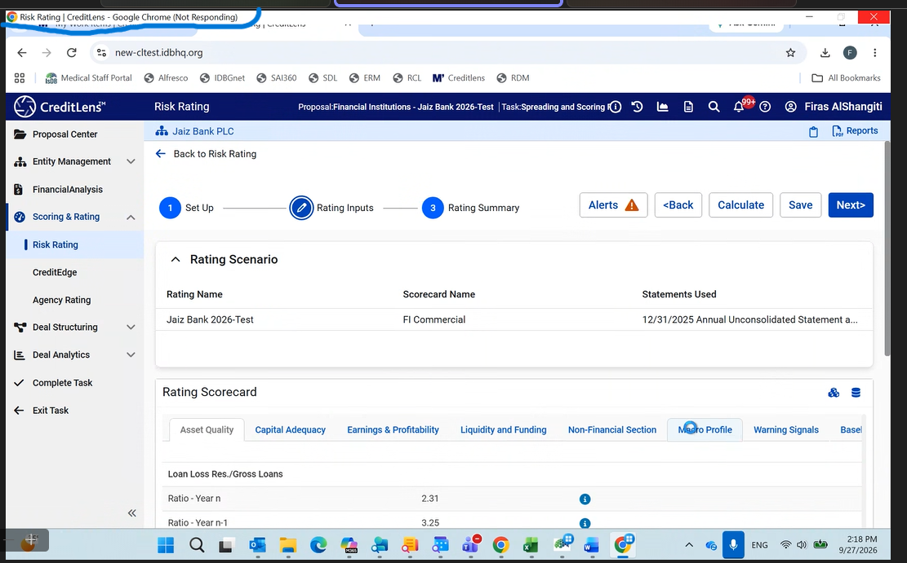
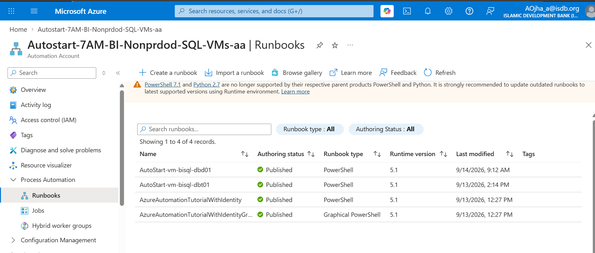

## Slowness in a particular Feature
> Chrome Gave issues ... But same app when tested from Localhost presented no issues.
- Browser Dev Tools displayed `200` and `304` status

- The CreditLens slowness issue is occurring when accessing the application through the latest versions of Google Chrome and Microsoft Edge. However, the application was observed to perform normally when accessed using an older version of Chrome.
- We validated the same application and functionality on Firefox browser installed on the Dev AVD, and the application worked as expected without any performance issues or slowness.
- Logs displayed `signalR request when used via HTTPS and App Gateway` but `LocalHost had no such signalR` both request took almost same time. 
## Auto Start Azure VM 

On azure automation account: 
1. Create Powershell runbook
2. Create schedule
3. GIve automation account managed identity VM contributor Role
> BTW Can see automation account already have auto-start-stop VM option on left side but IDB not using
```pwsh
# Authenticate using Managed Identity
Connect-AzAccount -Identity

# Set subscription context (optional if only one subscription)
# Get-AzContext or Set-AzContext can be used if needed

# Define your VMs and resource group
$vmNames = @("vm-bisql-dbd01")
$resourceGroup = "rg-bibw-dev-01"

foreach ($vm in $vmNames) {

    $vmStatus = Get-AzVM -ResourceGroupName $resourceGroup -Name $vm -Status
    $powerState = ($vmStatus.Statuses | Where-Object { $_.Code -like "PowerState*" }).Code

    Write-Output "Detected state for ${vm}: $powerState"

    if ($powerState -in @("PowerState/stopped", "PowerState/deallocated")) {
        Write-Output "Starting $vm..."
        Start-AzVM -ResourceGroupName $resourceGroup -Name $vm
    }
    else {
        Write-Output "$vm is already running. Skipping start."
    }
}
```