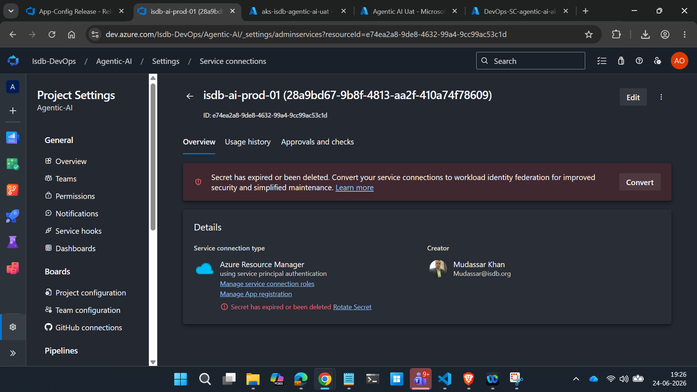
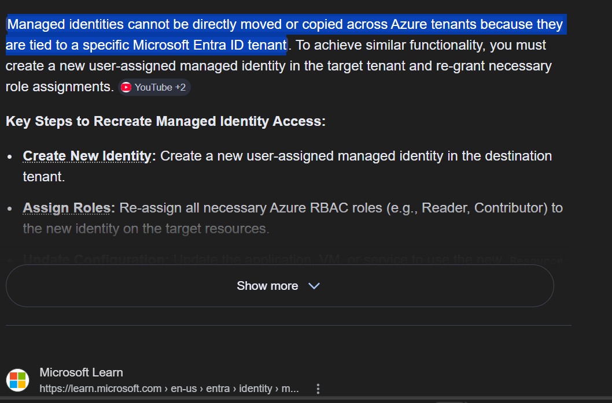
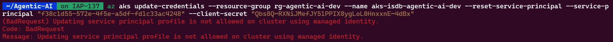
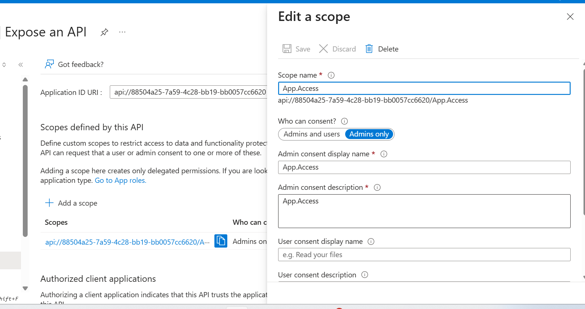
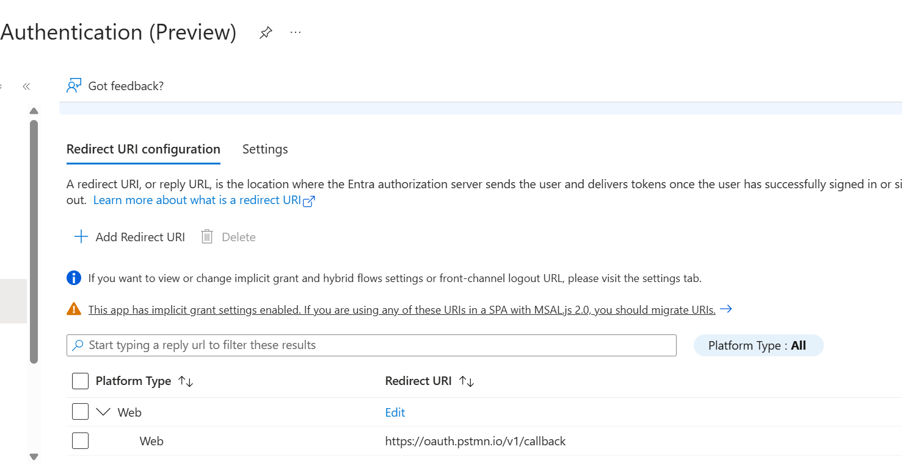
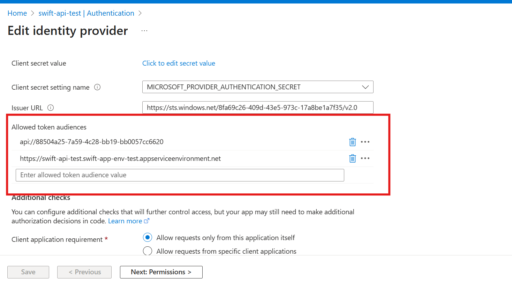

# what should you know
- Browser dev tools
- curl command
- HTTP status codes <=> common reasons
- HTTP 1 vs HTTP2 // how it links to cypher suits
- standard ports, processes names and server name and logs locations of dependent services [Like SMTP, AMQ] and RACI for support
- request flow of an app and how to test dns, service etc 

# How to troubleshoot
- google the visible error (like HTTP Error 500.30 - ANCM In-Process Start Failure: `is asp.net` startup failure on iis)
- Identify linked root resource (like service connection used in pipeline, which ACR its trying to access etc)
- check HTTP status codes (to get an idea - 401,500 etc)
- Complete request flow (user > dns > network > targetip > windows service which will respond back)
- Have few culprits > check or any recent update / infra change 
- if it broke after update > check what that update includes / read its github issue (like in docker client update).. HTTP2 isn't supported by NTLM clients.

**examples:**
- if error msg mentions port number, google if its a standard port number. [like 61616 is for AMQ service]
- then check network connectivity and related process of for that port [maybe got into zombie process]
- check logs of affected service (like medical portal can't load expense, br dev tools show http 500, so go to logs of that page, which shows some DB error)

## DevOps Service connection renew
- Renew service connection... just open and click

- Docker Registry service connection do not have any VISIBLE secret on DevOps Portal but under hood, Azure App Registration and secret is created so gives error:
> ERROR: failed to build: failed to solve: failed to fetch oauth token: unauthorized: Invalid clientid or client secret.
 ##[error]Bash exited with code '1'.
Finishing: Buildx — registry cache (buildcache) and push

- If you don't do above, but renew manually from Portal... **DO NOT FORGET** to click 
service connection >> EDIT / SAVE. 
Else CLient ID [SAME] but SECRET [UPDATED], DevOps uses [OLD ENTRIES]

- code to discover what is service principal id
```sh
az login 
# command to install az devops cli
> o.txt

while IFS= read -r project; do
    echo "===== $project =====" >> o.txt

    az devops service-endpoint list \
        --project "$project" \
        --query "[?type=='azurerm'].{
            serviceprincipalid: authorization.parameters.serviceprincipalid,
            tenantid: authorization.parameters.tenantid,
            DevOps_Sc_Name: name,
            projectName: serviceEndpointProjectReferences[0].projectReference.name
        }" \
        -o table >> o.txt

    echo >> o.txt
done < <(az devops project list --query "value[].name" -o tsv)

```

## Permissions get reverted back when user tried add variable in release pipeline
- check interitance on `i` tab, change permissions there in parent

## Get All PAT Tokens in ADO
- PAT is now discouraged [Blog](https://devblogs.microsoft.com/devops/reducing-pat-usage-across-azure-devops/)
[Github Gist with Powershell script that lists all PAT](https://gist.github.com/kickinattech/188f860277ec86634639188fdc80a05c)
- if `targetAccounts            : ` Empty or Null then its a Global PAT. 
- Use MS Login Pop Up window to login to Azure Repo instead of Pat - [ms docs](https://learn.microsoft.com/en-us/azure/devops/repos/git/set-up-credential-managers?view=azure-devops)
## HTTP2 and NTLM apps broke >> App GW V2 Migration
[MS DOCS - Windows authentication (NTLM/Kerberos/Negotiate) is not supported with HTTP/2. In this case IIS will fall back to HTTP/1.1.](https://learn.microsoft.com/en-us/iis/get-started/whats-new-in-iis-10/http2-on-iis)
> Kerberos is the modern, secure default authentication protocol for Active Directory, utilizing tickets for mutual authentication, while NTLM is a legacy, less secure, challenge-response protocol.

**Links**:
- [HTTP 1.1 vs HTTP2 vs HTTP3](https://www.cloudflare.com/learning/performance/http2-vs-http1.1/)
- [NTLM with HTTP2](https://support.radware.com/app/answers/answer_view/a_id/19024/~/note-regarding-ntlm-with-http%2F2)
***

## Swift Pipeline springboot docker image Error:

https://learn.microsoft.com/en-us/azure/app-service/quickstart-java?tabs=springboot&pivots=java-javase
https://learn.microsoft.com/en-us/azure/app-service/configure-language-java-deploy-run?pivots=java-tomcat&tabs=linux

https://stackoverflow.com/questions/77305335/azure-python-functions-requirements-txt-ignored-when-deployed-from-devops

https://devblogs.microsoft.com/devops/upcoming-updates-for-azure-pipelines-agents-images/#windows

## Azure function App Code not visible post deployment
0. Check code works locally, if any error in code, function doesn't load
1. if shared subnet, check if it has enough ip left 
2. browse function URL.. means host is running
3. scale up/down function, that has force restart
4. remove vent integration, some times UDR, DNS makes issue

> MS SUpport Guy answered:
- `nslookup` from the VM resolved `stdevisdbfuncjirade01.blob.core.windows.net` to `10.194.27.20` (a Private Endpoint IP), via the `privatelink.blob.core.windows.net` Private DNS Zone linked to your VNet.
- The app works when VNet integration is disconnected (public DNS path) and breaks again when it is reconnected (private DNS path).
 
This proves that the Private Endpoint / Private DNS Zone path from the Function App's integrated subnet (`snet-jiradataextract-function`, 10.194.12.0/24) to the storage account is misconfigured or unreachable. You have two options:
 
Option A - Fix the Private Endpoint path :
1. Locate the Private Endpoint with NIC IP `10.194.27.20` and confirm it targets storage account `stdevisdbfuncjirade01`, sub-resource `blob`, status `Approved`.
2. Create Private Endpoints for the other Functions-required sub-resources too: `file`, `queue`, `table`, each with an A record in the matching Private DNS Zone (`privatelink.file/queue/table.core.windows.net`) linked to the VNet.
3. On `snet-jiradataextract-function`, ensure the NSG allows outbound TCP 443 to the PE subnet, and that no UDR is sending intra-VNet traffic through a firewall that drops it.
4. Restart the Function App.
 
Option B - Remove the private DNS path (uses public endpoint):
1. On Private DNS Zone `privatelink.blob.core.windows.net` (and `file`/`queue`/`table` if linked) → Virtual network links → unlink your VNet.
2. On storage account `stdevisdbfuncjirade01` → Networking → either enable public access, or add `snet-jiradataextract-function` under "Selected networks" with the `Microsoft.Storage` service endpoint.
3. Restart the Function App. A subsequent `nslookup` from the VM should now return a public IP.
 
Option A is the secure long-term design. Option B is faster and acceptable if Private Endpoint wasn't an intentional security requirement for this storage account.
 
Hope this info helps
Feel free to reach out if you have any query
## ☁️ Azure Application Gateway + IIS + NTLM (Mapped View)

*   ⇒ 🔁 repeated 401 / login loops  
    ⇒ App Gateway is L7, NTLM needs same TCP connection  
    ⇒ ❌ don’t use NTLM behind App Gateway → ✅ switch to Kerberos / modern auth [\[learn.microsoft.com\]](https://learn.microsoft.com/en-us/answers/questions/1051394/application-gateway-v2-still-able-to-support-ntlm), [\[linkedin.com\]](https://www.linkedin.com/pulse/conquering-ntlm-how-we-migrated-legacy-net-app-azure-solved-dutta-fb8mc/)

*   ⇒ 👥 users see other users’ identity/session  
    ⇒ App Gateway reuses backend connections, NTLM auth cached per connection  
    ⇒ 🚨 security risk → ✅ remove NTLM or move auth upstream [\[learn.microsoft.com\]](https://learn.microsoft.com/en-us/answers/questions/1051394/application-gateway-v2-still-able-to-support-ntlm), [\[supportsi....exagon.com\]](https://supportsi.hexagon.com/s/article/Azure-Application-Gateway-and-Dinwos-NTLM-support)

*   ⇒ 📈 issue only under load  
    ⇒ autoscale + connection pooling increases TCP reuse  
    ⇒ ✅ design change, not tuning knobs [\[linkedin.com\]](https://www.linkedin.com/pulse/conquering-ntlm-how-we-migrated-legacy-net-app-azure-solved-dutta-fb8mc/)

*   ⇒ 🎯 cookie‑based affinity “enabled but still broken”  
    ⇒ affinity = same backend VM, **not same TCP connection**  
    ⇒ ❌ affinity cannot make NTLM safe on App Gateway [\[stackoverflow.com\]](https://stackoverflow.com/questions/60900680/multiple-login-prompts-from-azure-application-gateway-v2)

*   ⇒ 🌐 HTTP/2 enabled, NTLM fails randomly  
    ⇒ App Gateway supports client‑side HTTP/2, backend still multiplexed  
    ⇒ ✅ disable HTTP/2 on IIS **or** kill NTLM [\[stackoverflow.com\]](https://stackoverflow.com/questions/78246219/azure-application-gateway-http-2-not-working), [\[linkedin.com\]](https://www.linkedin.com/pulse/conquering-ntlm-how-we-migrated-legacy-net-app-azure-solved-dutta-fb8mc/)

*   ⇒ 🧹 works after AppGW restart / app‑pool recycle  
    ⇒ clears pooled connections + NTLM cache  
    ⇒ ❌ temporary illusion, issue returns [\[linkedin.com\]](https://www.linkedin.com/pulse/conquering-ntlm-how-we-migrated-legacy-net-app-azure-solved-dutta-fb8mc/)

*   ⇒ ❓ “but it works for one user / sometimes”  
    ⇒ NTLM appears fine until multiple users share connections  
    ⇒ ✅ expect silent failures + identity mixups [\[learn.microsoft.com\]](https://learn.microsoft.com/en-us/answers/questions/1051394/application-gateway-v2-still-able-to-support-ntlm)

*   ⇒ 🛑 App Gateway v2 + NTLM officially unsupported  
    ⇒ Microsoft confirms NTLM/Kerberos proxying not supported  
    ⇒ ✅ use different architecture [\[learn.microsoft.com\]](https://learn.microsoft.com/en-us/answers/questions/1051394/application-gateway-v2-still-able-to-support-ntlm), [\[supportsi....exagon.com\]](https://supportsi.hexagon.com/s/article/Azure-Application-Gateway-and-Dinwos-NTLM-support)

*   ⇒ ✅ **Safe Azure patterns**  
    ⇒ NTLM incompatible with L7 proxies  
    ⇒ ✅ Kerberos, ✅ Entra ID / OIDC, ✅ App Service Auth, ✅ header‑based auth [\[linkedin.com\]](https://www.linkedin.com/pulse/conquering-ntlm-how-we-migrated-legacy-net-app-azure-solved-dutta-fb8mc/), [\[blog.barracuda.com\]](https://blog.barracuda.com/2026/03/01/ntlm-is-going-away--what-microsoft-s-phaseout-means-for-msps-and)

*   ⇒ 🔄 **If NTLM is unavoidable (last resort)**  
    ⇒ App Gateway cannot be made safe  
    ⇒ ✅ use Azure **Internal Load Balancer (L4)** + HTTP/1.1 only [\[linkedin.com\]](https://www.linkedin.com/pulse/conquering-ntlm-how-we-migrated-legacy-net-app-azure-solved-dutta-fb8mc/)

***

### ✅ Azure‑Explicit One‑Line Takeaway

> **Azure Application Gateway (v1 or v2) + NTLM is fundamentally unsafe, especially with HTTP/2. The fix is not affinity or tuning — it’s removing HTTP2 by going to left side > `config` > NTLM or changing the load‑balancer layer.**

### Cross tenant Managed Identity

- `Managed Identity` = Enterprise App ONLY
- `Service Principal` = Enterprise App + App Registration
- So to get same App ID for a *Service Principal* across tenant follow : [MS DOCS - Possible via Pwsh GraphAPI](https://learn.microsoft.com/en-us/azure/azure-signalr/signalr-howto-authorize-cross-tenant)

## AKS 

> AKS Needs Cross Tenant Access to ACR... So thought to use multi-tenant Service Principal.
- MS restricted us to replace managed Identity with Service principal, AFTER CLUSTER CREATION. It must be re-created.
- But you can change ID isn't of method
```sh
az aks update-credentials --resource-group $RESOURCE_GROUP_NAME --name $CLUSTER_NAME --reset-service-principal --service-principal "$SP_ID" --client-secret "${SP_SECRET}"
```
- In Azure Kubernetes Service (AKS), an image pull secret is used to authenticate a cluster with a private container registry. While AKS-native integration using managed identities is the recommended method for Azure Container Registry (ACR), secrets are required for external or third-party registries.
```sh
kubectl create secret docker-registry crisdbagenticaprod \
    --namespace <namespace> \
    --docker-server=crisdbagenticaprod.azurecr.io \
    --docker-username=f38c1d55-572e-4f5e-a5df-fd1c33ac4248 \
    --docker-password='value'

kubectl patch serviceaccount default -n <YOUR_NAMESPACE> -p '{"imagePullSecrets": [{"name": "crisdbagenticaprod"}]}'
```
## Azure Functions
- When deployment stuck.. if restart doesn't helps .. create a new blob container and map it
- you checked function URL..you don't see function welcome page so host not running.. Scale-up/Down Memory of Functions, this forces 
restart  
- app insights => logs => exceptions table see code 139 which is OOM on linux

## App Service Debugging:
> HTTP 500 error - `A generic catch all error`: If the error only happens at start, it is a startup/config issue. If it happens while browsing, it is likely a code bug or resource constraint. 
- App service `windows` uses IIS, so for any startup errors or IIS errors go to adv tools > cmd/powershell > LogFiles\eventlog.xml (pencil icon) same way Linux uses docker_default.log  

### App Service hosts an API .. You implement Azure AuthN to ensure secure request
> user passing azure bearer token in AzureAppService-defaultDomain/endpoint but getting 401 (unauth) error

Links:
1. https://learn.microsoft.com/en-us/answers/questions/1168505/azuread-token-authentication-not-checking-allowed
2. https://learn.microsoft.com/en-us/azure/app-service/overview-authentication-authorization
How configure? 
1. Create App Registration -> expose API 



2. Add App IdP allowed audience


**how troubleshoot**?
- 401 Unauthorized: The server does not know who you are (missing or invalid authentication) and is asking you to log in.

1. go to https://jwt.ms/ decode bearer token to cross check tenant, app id etc
These are the **top 3 checks**, in the **exact order** that helps you isolate the problem quickly.

***

# ✅ **Top 3 Checks (Sequential) When Troubleshooting Allowed Token Audiences**

## **1️⃣ Check that the JWT’s `aud` claim exactly matches one of the Allowed Token Audiences**

This is the **#1 cause** of 401.

In **App Service → Authentication → Edit → Token settings (Advanced)**, verify:

*   `api://<your-api-id>`
*   `https://<your-webapp>.azurewebsites.net`
*   `https://<your-custom-domain>`

Your token’s `aud` must match **one** of these **exactly**, character‑for‑character.

👉 If even one character differs (including trailing slashes), EasyAuth returns **401 – invalid audience**.

***

## **2️⃣ Ensure you did not forget to include site URLs in Allowed Token Audiences**

Many cloud teams forget this.

EasyAuth accepts *both* styles of audiences:

### ✔ App ID URI

`api://88504a25-7a59-4c28-bb19-bb0057cc6620`

### ✔ Website HTTPS URL

`https://xyz.azurewebsites.net`

If the web URL is missing, and you request a token using:

    resource=https://xyz.azurewebsites.net

→ EasyAuth rejects it with **401**.

So always keep:

*   `api://<app-id>`
*   Web app URL(s)

in **Allowed Token Audiences**.

***

## **3️⃣ Verify whether the token type (delegated vs app-only) aligns with what EasyAuth expects**

Even if the audience matches, EasyAuth can reject the token when:

*   App exposes **delegated scopes**, but token is **app-only (.default)**
*   Or App exposes **app roles**, but token is **delegated**
*   Or the audience matches but no scope/role was granted

To check:

### Look for in token:

*   `"appidacr": "1"` → **app-only**
*   `"scp": "..."` → **delegated**
*   `"roles": [ ... ]` → app roles

If your token type doesn’t match what the API App Registration is configured for → **401** (Forbidden/Unauthorized).

***

# 🎯 **Quick memory rule**

When debugging EasyAuth 401 for audience problems:

> **AUD → URL → TYPE**  
> ✔ **A**udience  
> ✔ **U**RL allowed  
> ✔ **D**elegated/app-only token type

***

### Fircosoft webpage wasn't working restart Tomcat

### SDL server - user can't login
- since webpage shows -- app ok ✅
- Test DB connectivity from app: ` Test-NetConnection -ComputerName -Port`
        - **failed**: So one of 3:
                - DB Services stopped
                - Server stopped
                - FW/DNS issue

## Fixed outbound IP for Flex Azure Functions:
> app --> vnet --> UDR --> FW --> outbound public ip

### The Devs from ODM reported access token issued by azure have expiry of one day instead of 1 hour
- [MS Docs](https://learn.microsoft.com/en-us/entra/identity-platform/configure-token-lifetimes)
- [More info on tokens](https://learn.microsoft.com/en-us/entra/identity-platform/access-tokens#token-lifetime)

```sh
az account set -s 'isdb-prodmgmt-01'
echo "Successfully deployed the image:"
az acr manifest list-metadata --name 'swiftapi/swiftservice' --registry crisdbswiftcicdprod01 --output json | jq '.[] | select(.tags[]? == "latest") | {digest, lastUpdateTime, tags}'
```

## Replication Point fail in azure vm:
Azure Site Recovery supports churn (data change rate) up to 100 MB/s per virtual machine. You'll be able to protect your Azure virtual machines having high churning workloads (like databases) using the High Churn option in Azure Site Recovery, which supports churn up to 100 MB/s per virtual machine

https://learn.microsoft.com/en-us/azure/site-recovery/concepts-azure-to-azure-high-churn-support


# Rating ToolKit (App GW)

We are encountering an issue with the Azure Application Gateway configuration affecting the following domains routed to the backend Apache server on **AZAPRTT01**:

* **rm2rcltest.idbhq.org** (Rating Manager v2 – Angular application)
* **re2rcltest.idbhq.org** (Rating Engine v2 – Spring Boot application)

Both applications operate correctly when accessed directly on the Apache server. However, when accessed through the Azure Application Gateway, the request results in a **502 Bad Gateway** error returned by the gateway.

***

## Evidence and Technical Symptoms

### 1. Internal Test on AZAPRTT01 (Apache Backend)

Using `curl` with the correct Host header produces the expected response:

```bash
curl -I http://localhost -H "Host: rm2rcltest.idbhq.org"
```

Response:

```http
HTTP/1.1 301 Moved Permanently
Location: https://rm2rcltest.idbhq.org/
Server: Apache/2.4.46
```

This confirms the Apache VirtualHost for `rm2rcltest.idbhq.org` is functioning correctly.

***

### 2. External Test Through Application Gateway

When performing the same test from a session desktop (which routes through the Application Gateway), we receive:

```bash
curl -I https://rm2rcltest.idbhq.org -H "Host: rm2rcltest.idbhq.org"
```

Response:

```http
HTTP/1.1 502 Bad Gateway
Server: Microsoft-IIS/10.0
```

This confirms the request is not reaching Apache successfully and the **502** is being returned by the Application Gateway.

***

### 3. Comparison with a Working Domain (Rating Manager v1)

For reference, another domain routed through the gateway works as expected:

```bash
curl -I https://rmrcltest.idbhq.org -H "Host: rmrcltest.idbhq.org"
```

Response:

```http
HTTP/1.1 200 OK
Server: Apache/2.4.46
```

This further indicates that the issue is limited to the new domain configurations and likely related to **Host header handling** or **health probe configuration**.

***

## Root Cause Summary

The behavior strongly indicates that the Application Gateway is not forwarding the original **Host** header to the backend for the new domains.

Apache relies on the **Host** header to select the correct VirtualHost. When the Application Gateway overwrites the Host header (for example, replacing it with the backend IP or internal hostname), Apache routes the request to the wrong VirtualHost, causing the probe to fail and the backend to be marked unhealthy. This results in the **502** response.

Internally, Apache receives the correct Host header and routes properly, confirming the backend configuration is correct. The failure only occurs when routed through the Application Gateway.

***

## Required Changes on the Application Gateway

Please review and update the HTTP Settings for:

* `rm2rcltest.idbhq.org`
* `re2rcltest.idbhq.org`

### HTTP Settings

* **Protocol:** HTTPS
* **Port:** 443
* **Use host name from incoming request:** Enabled
* **Override with specific host name:** Disabled
* **Pick host name from backend target:** Disabled
* **Use well-known headers:** Enabled
* **Allow self-signed certificates (if applicable):** Enabled

These settings ensure that the backend receives the correct **Host** header.

***

## Health Probe Requirements

Each domain requires a dedicated probe.

### Probe for rm2rcltest.idbhq.org

* **Protocol:** HTTPS
* **Host:** rm2rcltest.idbhq.org
* **Path:** /

### Probe for re2rcltest.idbhq.org

* **Protocol:** HTTPS
* **Host:** re2rcltest.idbhq.org
* **Path:** /

If the probe uses an IP address, backend pool FQDN, or internal hostname, Apache will select the wrong VirtualHost and mark the pool as unhealthy.

***

## Verification Tests After the Change

### 1. Confirm Backend Health

Verify backend health status changes to **Healthy** for both domains.

***

### 2. Test Forced Host Header Routing Through the Gateway

```bash
curl -I https://<GatewayPublicIP> -H "Host: rm2rcltest.idbhq.org"
```

Expected result:

```http
301 redirect to https://rm2rcltest.idbhq.org:9103/
```

(Angular v2)

***

### 3. Validate External Access

```bash
curl -I https://rm2rcltest.idbhq.org
curl -I https://re2rcltest.idbhq.org
```

Ensure the gateway no longer returns **502 Bad Gateway**.

***

# FI (Zombie Service)

## Symptoms

FusionInvest clients and services were unable to launch due to not being able to connect to the AMQ messaging bus. This also caused some night batches to fail.

***

## Troubleshooting

With the help of the Application team, we connected to the FI application server for a remote session.

It was noticed that the AMQ service would start and then stop immediately.

Looking at the AMQ logs (only accessible locally):

```text
D:\FusionInvest\Servers\Sophis\AMQ\apache-activemq\data
```

it was observed that the process could not bind to the standard port **61616**.

Further investigation revealed that a Java process was already using port **61616**, which was identified as a previous AMQ process that had become detached from the Windows service and turned into a zombie (unresponsive) process.

***

## Remediation

Once the zombie process was identified:

```bash
netstat -ano | findstr :61616
```

it was manually terminated, and the AMQ services could be started normally through **Windows Services**.

A full stop/start cycle was then triggered, all services started normally, and FusionInvest client connectivity was restored.

***

## Recommendation

* Monitor start/stop processes during the next few days.
* Add additional monitoring for unexpected ports remaining in use after a stop sequence to identify possible zombie processes earlier.

***

## Notes

The reason why the AMQ process became a zombie is currently unclear and could be due to several factors, including:

* Improper Windows process management.
* Java process running out of memory and becoming unresponsive.
* Other Java runtime-related issues.

It was also observed that **Keycloak** (a Java process independent of FI services) was not functioning during the troubleshooting process, although it should have been operational.

This may indicate a broader Java-related issue, such as:

* Java runtime instability.
* Automatic Java updates.
* JVM resource exhaustion.
* OS-level process handling issues.

Further analysis of both **AMQ** and **Keycloak** will be performed to identify any additional clues and determine the root cause.


