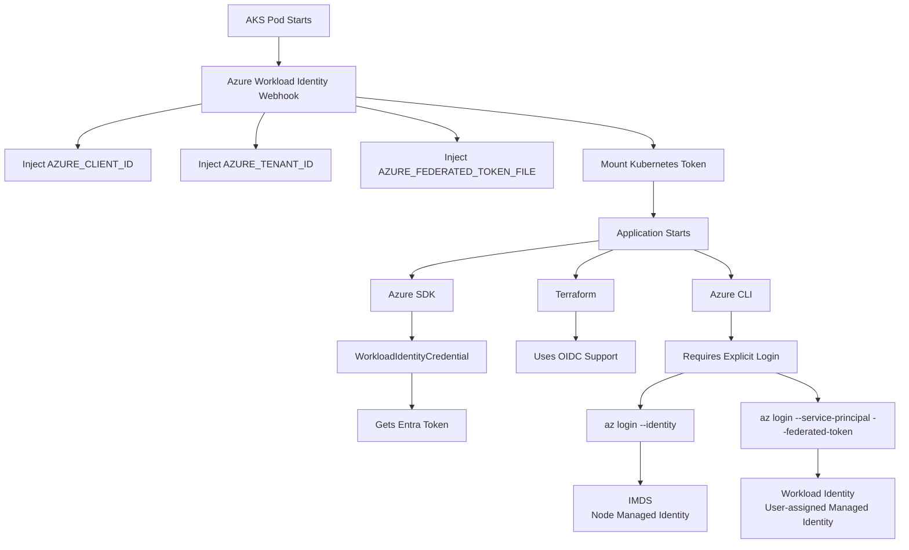
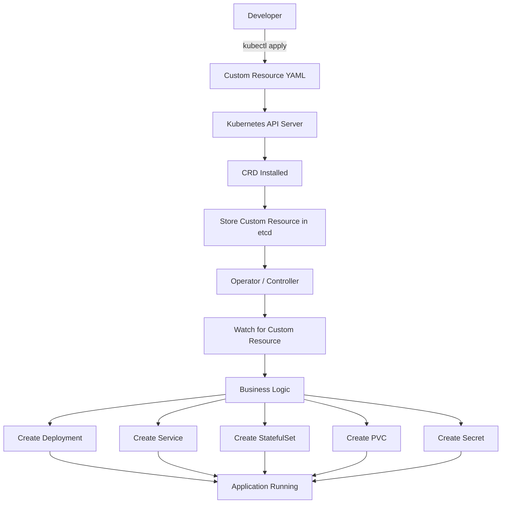

### Config Map
>  decouple environment-specific configuration from your container images, so that your applications are easily portable.
- A ConfigMap is an API object used to store non-confidential data in key-value pairs.
- You can write a Pod spec that refers to a ConfigMap and configures the container(s) in that Pod based on the data in the ConfigMap.
- The Pod and the ConfigMap must be in the same namespace.
- Mounted ConfigMaps are updated automatically. the total delay from the moment when the ConfigMap is updated to the moment when new keys are projected to the Pod can be as long as the kubelet sync period + cache propagation delay, where the cache propagation delay depends on the chosen cache type (it equals to watch propagation delay, ttl of cache, or zero correspondingly).

| Situation                        | Best choice            | Example                                                                                                                                                        |
| -------------------------------- | ---------------------- | -------------------------------------------------------------------------------------------------------------------------------------------------------------- |
| Simple key-value configuration   | Environment variables  | `LOG_LEVEL=INFO`, `APP_ENV=prod`                                                                                                                               |
| Application uses CLI flags       | Command-line arguments | `--port=8080`, `--debug=false`                                                                                                                                 |
| Application expects config files | Volume mount           | `nginx.conf`, `application.yml`, `prometheus.yml`, `haproxy.cfg`                                                                                               |
| Large structured configuration   | Volume mount           | YAML, JSON, XML, INI files                                                                                                                                     |
| Configuration changes frequently | Volume mount           | Mounted ConfigMaps can be updated on disk without recreating the ConfigMap itself, though whether the application picks up changes depends on the application. |

### Pratically checked.... updated configmap (which was mounted as env) and pods don not show new value. | Restart Pods via Rollout
4 ways to declare config:
1. Inside a container command and args
2. Environment variables for a container
3. Add a file in read-only volume, for the application to read
4. Write code to run inside the Pod that uses the Kubernetes API to read a ConfigMap
- for first 3 kubelet uses the data from the ConfigMap when it launches container(s) for a Pod.
note:
A ConfigMap is not designed to hold large chunks of data. The data stored in a ConfigMap cannot exceed 1 MiB. If you need to store settings that are larger than this limit, you may want to consider mounting a volume or use a separate database or file service.

#### ConfigMap as volume:
```
etcd
  │
  ▼
API Server
  │
  ▼
kubelet on Worker-2
  │
  ▼
creates local volume
  │
  ▼
mounts it into container
```

```yml
apiVersion: apps/v1
kind: Deployment

metadata:
  name: api-deployment
  labels:
    app: api
    Deployed: "true"
    creator: AJ
    env: dev

spec:
  replicas: 5

  selector:
    matchLabels:
      app: api
      env: dev

  template:
    metadata:
      labels:
        app: api
        env: dev

    spec:
      containers:
        - name: api
          image: acr8r.azurecr.io/api:v1.1
          ports:
            - containerPort: 8000
          # envFrom:
          #   - configMapRef:
          #       name: simple-configmap
          volumeMounts:
            - name: env-vars
              mountPath: "/etc/simple01"
              readOnly: true
      volumes:
        - name: env-vars
          configMap:
            name: simple-configmap
```
* **`/etc/foo` is created by the kubelet on the node where the Pod is running.** It fetches the ConfigMap from the Kubernetes API server and mounts it into the container at `/etc/foo`.

* **The ConfigMap is the persistent source of truth.** It is stored in the cluster (in etcd via the API server), not on any specific worker node.

* **The mounted `/etc/foo` directory is ephemeral.** It exists only for the lifetime of the Pod and is removed when the Pod is deleted.

* **If the Pod is rescheduled to another node,** the kubelet on the new node fetches the same ConfigMap and recreates the `/etc/foo` mount automatically.

* **ConfigMap volumes are for configuration, not data persistence.** If you need data to survive Pod deletion or restarts, use a **PersistentVolume (PV)** and **PersistentVolumeClaim (PVC)** instead.

```
apiVersion: v1
kind: ConfigMap
metadata:
  name: simple-configmap
data:
  APP_ENV: dev
  DB_HOST: mysql
  DB_PORT: "3306"

Inside your pod:

/etc/simple01/
├── APP_ENV
├── DB_HOST
└── DB_PORT

You will not get:

echo $APP_ENV

because you did not inject environment variables.
```
#### Rollout
command triggers a graceful, zero-downtime rolling restart of your pods. Under the hood, it injects a timestamp annotation into the pod template, forcing Kubernetes to sequentially spin up new pods and terminate old ones according to your deployment's update strategy.
 Valid resource types include:

  *  deployments
  *  daemonsets
  *  statefulsets

```sh
# check if value updated here
 kubectl get configmap name: simple-configmap -o yaml

 kubectl rollout undo/restart/status deployment/abc
  # Restart deployments with the 'app=nginx' label
  kubectl rollout restart deployment --selector=app=nginx
```

### Secrets
- Using a Secret means that you don't need to include confidential data in your application code.
- Secrets can be mounted as data volumes or exposed as environment variables to be used by a container in a Pod.
- Secret needs to be created before any Pods that depend on it
- behaves same like configmaps... rollout after updates // when mounted as drive, each secret is a file.
> Caution: Kubernetes Secrets are, by default, stored unencrypted in the API server's underlying data store (etcd). Anyone with API access can retrieve or modify a Secret, and so can anyone with access to etcd.
- You can use Secrets for purposes such as the following:
1. Set environment variables for a container.
2. Provide credentials such as SSH keys or passwords to Pods.
3. Allow the kubelet to pull container images from private registries.

### Service Account
- A `default` SA is created in every NameSpace.
> Kubernetes does not separate Users vs SA because RBAC needs two concepts; it separates them because identity creation, credential management, and lifecycle are fundamentally different for people and software.

| Concern                   | Human User | ServiceAccount |
| ------------------------- | ---------- | -------------- |
| Created by Kubernetes     | No         | Yes            |
| Namespace scoped          | No         | Yes            |
| Used by Pods              | No         | Yes            |
| Managed by external IdP   | Usually    | No             |
| Automatic token lifecycle | External   | Kubernetes     |
| Interactive login         | Yes        | No             |

##### ServiceAccount token volume projection: Assign a temp JWT token to pod
- Microsoft Entra Workload ID uses Service Account Token Volume Projection to enable pods to use a Kubernetes identity.
- Workload ID covers the pod-to-Azure identity scenario in AKS - how applications running in pods authenticate to Microsoft Entra-protected services
- On AKS automatic, this opetion is pre-configured.
> The projected ServiceAccount token is not an Azure access token. It's a Kubernetes-issued identity document that proves "this pod is running as ServiceAccount X in namespace Y." Azure Workload Identity uses that proof to obtain a real Azure access token from Microsoft Entra ID. That's why ServiceAccount token projection is the foundation that makes secretless authentication from AKS to Azure resources possible.
```
Deployment
      │
      ▼
Uses ServiceAccount "storage-reader"
      │
      ▼
Kubernetes generates a temporary ServiceAccount token
      │
      ▼
The token is projected (placed) into the pod as a file
      │
      ▼
Azure Identity SDK reads the token
      │
      ▼
The SDK sends it to Microsoft Entra ID
      │
      ▼
Entra ID checks:
"Is this ServiceAccount trusted?"
      │
      ▼
If yes, it issues an Azure access token
      │
      ▼
The pod uses that Azure token to access Azure Storage, Key Vault, or other resources based on the managed identity's RBAC permissions.
```
[MS DOCS on Managed Identity and Pod permissions](https://learn.microsoft.com/en-us/azure/aks/workload-identity-deploy-cluster?utm_source=chatgpt.com&tabs=new-cluster&pivots=azure-cli#create-a-kubernetes-service-account)
- AKS needs `User assigned Managed Identity` not system assigned as then every application would inherit the same permissions As 1 system identity => 1 Azure Resource.
- Use the AKS managed identity (system- or user-assigned) for cluster infrastructure (for example, managing load balancers, disks, or other Azure resources on behalf of Kubernetes).
- Use Microsoft Entra Workload Identity with user-assigned managed identities for application workloads.


### The Flow
what I observed: 
1. az --version worked but az account show failed and asked to login.
2. I did az login --identity command, then I started getting az account show output 
3. But above command, `picked up the nodepool managed identity not user assigned managed identity available in the env variables`
4. I ran az login --service-principal \ -u $AZURE_CLIENT_ID \ -t $AZURE_TENANT_ID \ --federated-token "$(cat $AZURE_FEDERATED_TOKEN_FILE)" since now I'm forcing to use user assigned managed identity, everything worked as intented.
- The Azure Workload Identity webhook does not authenticate the pod. Instead, it only injects things like:
```sh
env | grep AZURE
AZURE_TENANT_ID=059xxxxxxxxxxxxxxx
AZURE_FEDERATED_TOKEN_FILE=/var/run/secrets/azure/tokens/azure-identity-token
AZURE_AUTHORITY_HOST=https://login.microsoftonline.com/
AZURE_CLIENT_ID=60c2df9xxxxxxxxxxx

# To check how you authenticated
az account get-access-token --resource https://management.azure.com     --query accessToken -o tsv | cut -d '.' -f2 | base64 -d | jq

## Below command forces IMDS 
az login --identity

# so for az cli
az login --service-principal   -u $AZURE_CLIENT_ID   -t $AZURE_TENANT_ID   --federated-token "$(cat $AZURE_FEDERATED_TOKEN_FILE)".
```
- The SDK checks: "Do I have a workload identity?"

It sees

AZURE_CLIENT_ID
AZURE_TENANT_ID
AZURE_FEDERATED_TOKEN_FILE

and automatically constructs a `WorkloadIdentityCredential.`

It exchanges
```
Kubernetes token
        ↓
Microsoft Entra
        ↓
Access token for managed identity

No explicit login is required.
```
- This is why Microsoft recommends using DefaultAzureCredential() inside AKS.
> When requesting tokens with WorkloadIdentityCredential, pass scopes using the Microsoft Entra ID v2 format <resource>/.default, such as https://management.azure.com/.default. A raw resource URI, such as https://management.azure.com/, can fail because workload identity uses the Microsoft Entra v2 token endpoint rather than the IMDS resource flow used by managed identity. For more information about how scopes work in the v2 token endpoint, see Get a token.
- [MS DOCS](https://learn.microsoft.com/en-us/azure/aks/workload-identity-overview?tabs=python#azure-identity-client-libraries)


## WHY FEDERATED IDENTITY WITH AKS DETAILS NEEDED AT USER MANAGED ID?
1. Open Day2 Folder, there we deploy - https://mcr.microsoft.com/en-us/artifact/mar/azure-cli/tag/latest and use workload identity and service account to access azure.

```sh
VM
│
├── Managed Identity attached
│
└── Azure knows:
      "This VM owns this identity."
----------------
VM
   │
   ▼
Instance Metadata Service (IMDS)
   │
   ▼
Entra ID
---------------
Azure trusts the VM because Azure created the VM and attached the identity. =====> No secrets are needed.

Pods are different.
********************* Pods are not Azure resources. **************************
Azure knows nothing about THEM
```
> A Managed Identity tells Azure "who you want to be." An AKS OIDC token proves "who you are in Kubernetes." The Federated Credential is the trust policy that tells Microsoft Entra, "When this specific Kubernetes ServiceAccount presents a valid OIDC token from this AKS cluster, allow it to act as this specific Managed Identity." Without that policy, Azure has no secure basis for mapping a Kubernetes identity to an Azure identity.
```mermaid
sequenceDiagram
    participant Pod
    participant K8s as Kubernetes API Server
    participant OIDC as AKS OIDC Provider
    participant Entra as Microsoft Entra ID
    participant MI as User Assigned Managed Identity
    participant ARM as Azure Resource Manager

    Note over Pod: Pod starts with ServiceAccount

    K8s->>Pod: Mount ServiceAccount JWT
    K8s->>Pod: Inject AZURE_CLIENT_ID
    K8s->>Pod: Inject AZURE_TENANT_ID
    K8s->>Pod: Inject AZURE_FEDERATED_TOKEN_FILE

    Note over Pod: Application requests Azure credentials

    Pod->>Entra: Present Kubernetes JWT + Managed Identity Client ID

    Entra->>OIDC: Verify JWT signature & issuer

    OIDC-->>Entra: JWT is valid

    Entra->>Entra: Look for Federated Credential on Managed Identity

    alt Federated Credential matches
        Note over Entra: Issuer matches<br/>Subject matches<br/>Audience matches
        Entra->>MI: Impersonate Managed Identity
        MI-->>Entra: Identity confirmed
        Entra-->>Pod: Azure Access Token
        Pod->>ARM: Call Azure Resource Manager
        ARM-->>Pod: Authorized using Managed Identity RBAC
    else No matching Federated Credential
        Entra-->>Pod: Authentication Failed
    end
  ```
- The `AWS Instance Metadata Service (IMDS)` is an on-instance service that provides configuration data, network information, and temporary security credentials to your running Amazon EC2 instances. It is universally accessed via the link-local IP address `169.254.169.254`. https://docs.aws.amazon.com/AWSEC2/latest/UserGuide/configuring-instance-metadata-service.html

- The `Azure Instance Metadata Service (IMDS)` is a RESTful REST API accessible from within running Azure VMs at the non-routable IP `169.254.169.254`. It provides instance-specific details, managed identity tokens, and scheduled maintenance events without exposing data externally. https://learn.microsoft.com/en-us/azure/virtual-machines/instance-metadata-service?tabs=windows

### CSI, CNI, CRI and CRDs
- CRI = How Kubernetes talks to container runtimes.
- CNI = How Kubernetes sets up networking.
- CSI = How Kubernetes manages storage.
- CRD = A way to teach Kubernetes about entirely new resource types.
| Concept | Full Form                   | Purpose                                            | Examples                                 |
| ------- | --------------------------- | -------------------------------------------------- | ---------------------------------------- |
| **CRI** | Container Runtime Interface | Standard API between kubelet and container runtime | containerd, CRI-O                        |
| **CNI** | Container Network Interface | Standard for Pod networking                        | Calico, Cilium, Flannel                  |
| **CSI** | Container Storage Interface | Standard for storage integration                   | AWS EBS CSI, Azure Disk CSI, Ceph CSI    |
| **CRD** | Custom Resource Definition  | Adds new resource types to the Kubernetes API      | Database, Kafka, Certificate, Prometheus |

```txt
               Kubernetes Control Plane

                 kubectl
                    │
                    ▼
             Kubernetes API Server
                    │
          ┌─────────┴─────────┐
          │                   │
          ▼                   ▼
     Built-in Objects     Custom Objects
     (Pod, Service)      (CRDs)
          │                   │
          ▼                   ▼
      Scheduler         Operator/Controller
          │                   │
          └─────────┬─────────┘
                    ▼
                 kubelet
        ┌──────────┼──────────┐
        ▼          ▼          ▼
      CRI        CNI         CSI
        │          │          │
        ▼          ▼          ▼
   Containers   Networking  Storage
        │          │          │
        └──────────┴──────────┘
                   ▼
             Linux Kernel
     (Namespaces, cgroups, networking,
       filesystem, device drivers)
```

### CRD
- "Am I just passing data to an application, or am I introducing a new thing that Kubernetes should actively manage?"
```
Passing data → ConfigMap or Secret.
Managing a new type of infrastructure or application lifecycle → CRD (typically with an Operator).
```
That's the core problem CRDs solve: they let you express higher-level intent instead of manually assembling many lower-level Kubernetes resources. Like Crossplane, Promethous on CRDs

Suppose you create a CRD called: **Database** Now Kubernetes understands:
```yml
apiVersion: company.com/v1
kind: Database
```
You have created a brand new Kubernetes object.
- Without a CRD:
```txt
kubectl apply

↓

Error

Unknown Kind: Database
```
- After installing the CRD:
```txt
kubectl get databases

works exactly like:

kubectl get pods
```
- Diagram: 

